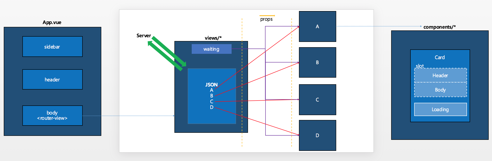

# portfolio-vue
## [Portfolio Site](https://hotehrud.github.io/portfolio-vue)
> A Vue.js project

<pre>
 ┬  
 ├ assets
 ├ components
     ┬ 
     ├ *
     ├ shard-components
 ├ js
 ├ router
 ├ sass
 ├ views
</pre>

<ul>
  <li>Client
    <ul>
      <li>Architecture - single page application</li>
      <li>Framework - vue.js</li>
      <li>Layout - flex</li>
      <li>Style sheet - scss</li>
    </ul>
  </li>

  <li>Server
    <ul>
      <li>Architecture - restful api</li>
      <li>Framework - express</li>
      <li>Provider - amazon</li>
      <li>DB - mysql</li>
    </ul>
  </li>
</ul>



## Build Setup

``` bash
# install dependencies
npm install

# serve with hot reload at localhost:8080
npm run dev

# build for production with minification
npm run build

# build for production and view the bundle analyzer report
npm run build --report

# run unit tests
npm run unit

# run e2e tests
npm run e2e

# run all tests
npm test
```

For a detailed explanation on how things work, check out the [guide](http://vuejs-templates.github.io/webpack/) and [docs for vue-loader](http://vuejs.github.io/vue-loader).
